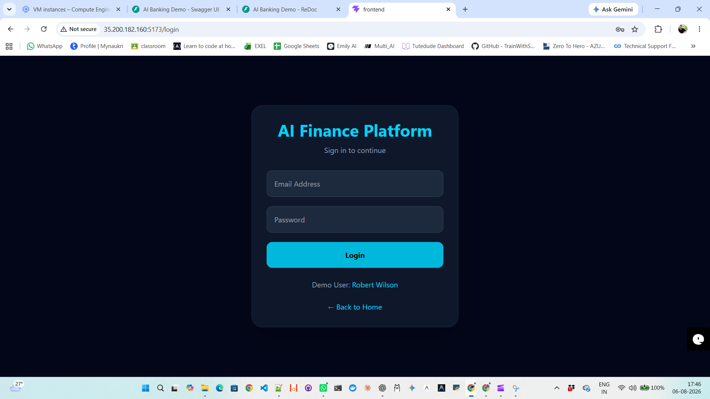
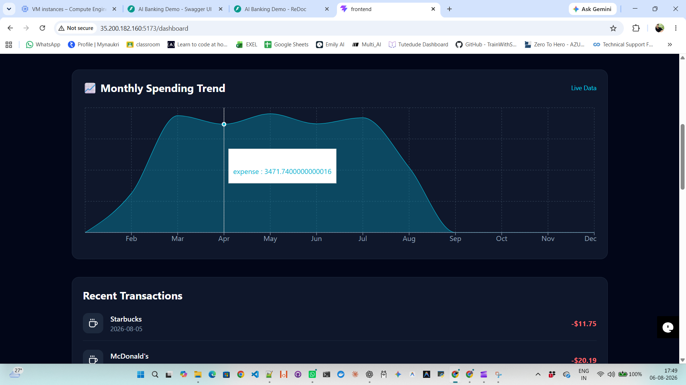
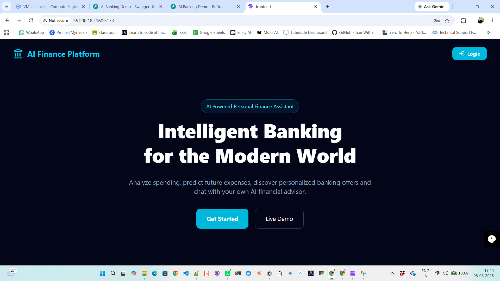
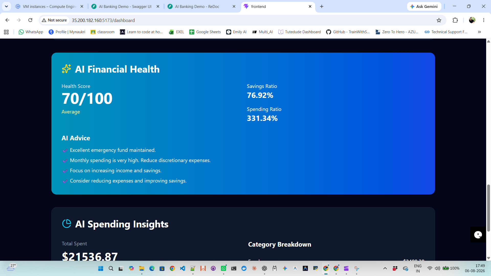
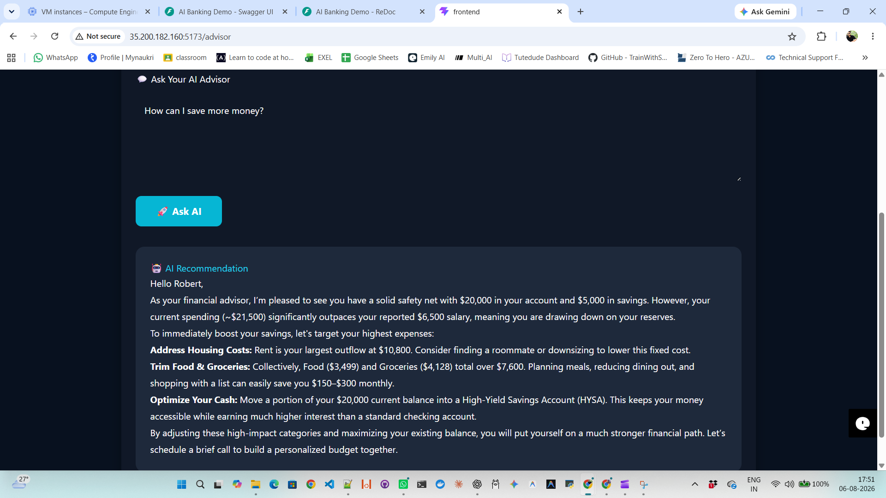
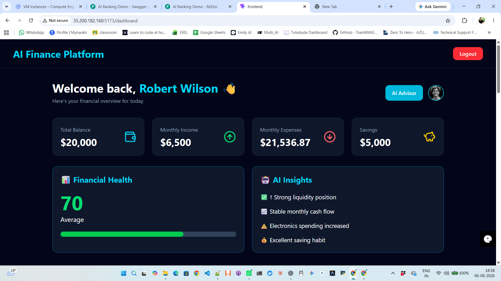
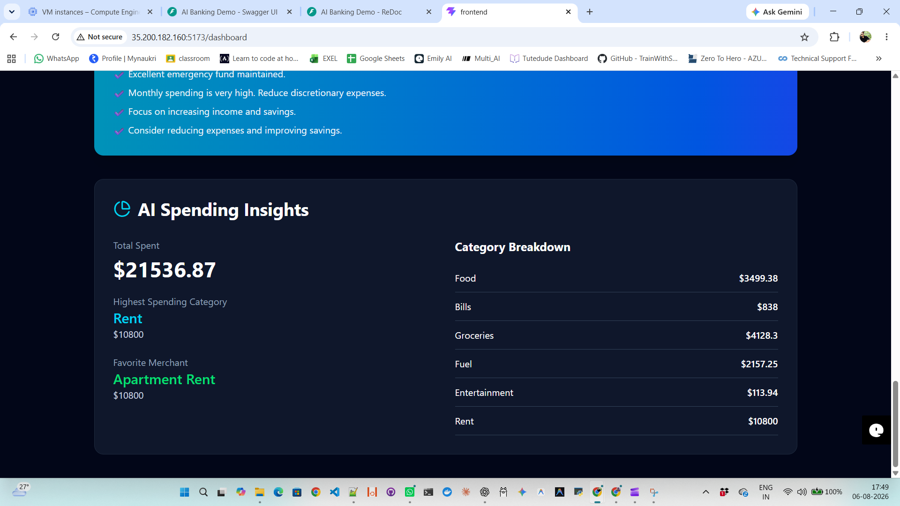
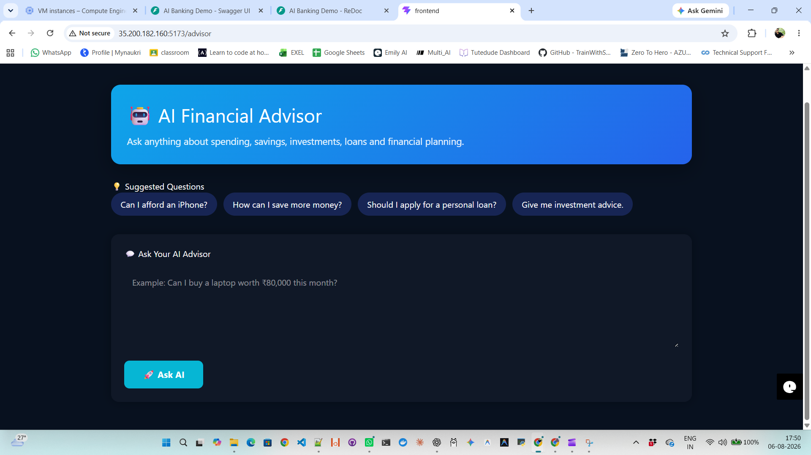

---

# 📷 Application Screenshots

The following screenshots showcase the major features of the AI Banking System, including the login page, dashboard, AI insights, spending analytics, financial health analysis, and advisor recommendations.

---

## 🔐 Login Page

Secure authentication page for accessing the AI Banking Dashboard.

<p align="center">
  
</p>

---

## 🏦 Banking Dashboard

The dashboard provides an overview of:

- Total Balance
- Monthly Income
- Expenses
- Savings
- AI Financial Health Score
- Financial Insights

---

## 📊 Spending Analytics

Interactive charts showing customer spending trends and expense distribution.

<p align="center">
  
</p>

---

## 🤖 AI Banking Intelligence

A centralized AI dashboard providing intelligent banking insights based on customer transactions.

Features include:

- Spending Summary
- Financial Intelligence
- AI Analysis
- Smart Insights

<p align="center">
  
</p>

---

## 💰 AI Spending Analysis

The AI engine analyzes spending behavior to identify:

- High Spending Categories
- Monthly Trends
- Customer Spending Habits
- Expense Distribution


---

## ❤️ AI Financial Health Check

The Financial Health Engine evaluates customer finances using:

- Income
- Expenses
- Savings
- Spending Ratio
- Financial Health Score

<p align="center">
  
</p>

---

## 💡 AI Recommendations

Personalized recommendations generated from customer transaction history.

Examples include:

- Reduce unnecessary spending
- Improve savings
- Better financial planning
- Budget optimization

<p align="center">
  
</p>

---

## 🧠 AI Financial Advisor

Dedicated AI Advisor that helps customers make smarter financial decisions through intelligent recommendations.


---

# 🎥 Project Demo

Watch the complete project walkthrough demonstrating:

- User Login
- AI Banking Dashboard
- PostgreSQL Integration
- Live Transactions
- Spending Analytics
- AI Financial Health
- AI Recommendations
- FastAPI REST APIs
- Swagger Documentation

> 📹 **Demo Video:** *(Add your GitHub video link here after uploading the demo.)*

---

# 🌟 Highlights

✔️ AI-powered Financial Intelligence

✔️ Modern Banking Dashboard

✔️ Dynamic PostgreSQL Integration

✔️ Interactive React UI

✔️ FastAPI REST APIs

✔️ AI Spending Analysis

✔️ Financial Health Score

✔️ Personalized Recommendations

✔️ Dockerized Deployment

✔️ Google Cloud Deployment

✔️ Production-ready Project Architecture

---

<div align="center">

# 🏦 AI Banking System
### 🤖 AI-Powered Financial Intelligence Platform

<p align="center">


</p>

**Transforming Banking Data into Actionable Financial Intelligence using AI**

Built with ❤️ using React, FastAPI, PostgreSQL, Docker & Google Cloud Platform.

---

### 🌐 Live Demo

🖥️ **Frontend**

http://35.200.182.160:5173

📄 **Swagger**

http://35.200.182.160:8000/docs

📂 **GitHub**

https://github.com/ai-aadi-ops/AI-Banking-System

</div>

---

# 📌 Overview

Traditional banking dashboards only display account balances and transaction history.

This project demonstrates how Artificial Intelligence can analyze customer spending behavior, calculate financial health, and generate intelligent recommendations to help customers make smarter financial decisions.

The platform is designed to simulate how modern digital banks can leverage AI-powered analytics to improve customer engagement and enable data-driven decision making.

---

# 🎯 Business Problem

Traditional banking applications generally provide:

- Account Balance
- Transaction History
- Mini Statement

But they don't answer questions like:

- Am I overspending?
- How healthy are my finances?
- What category consumes most of my income?
- Where can I save money?
- What financial advice should I follow?

This project addresses these challenges using AI-driven financial analytics.

---

# ✨ Features

## 💳 Smart Banking Dashboard

- Real-time Banking Dashboard
- Total Balance
- Income
- Expenses
- Savings
- Financial Health Score

---

## 🤖 AI Financial Intelligence

- AI Financial Health Score
- Spending Pattern Analysis
- Personalized Financial Recommendations
- Monthly Expense Insights
- Financial Health Classification

---

## 📊 Interactive Analytics

- Spending Trend Charts
- Monthly Expense Distribution
- Category-wise Analysis
- Dynamic Dashboard Cards
- Live Recent Transactions

---

## 🗄 Dynamic PostgreSQL Database

- Dynamic Transaction Generation
- Banking Data Seeder
- Realistic Banking Dataset
- Customer Transaction History

---

## ⚡ REST APIs

- Dashboard API
- Spending Chart API
- Transactions API
- Financial Health API
- AI Recommendation API

Swagger UI included.

---

## ☁ Cloud Deployment

- Dockerized Application
- Docker Compose
- Google Cloud Platform
- Multi-container Architecture

---

# 🏗 System Architecture

```
                    +----------------------+
                    |      React UI        |
                    +----------+-----------+
                               |
                               |
                     REST APIs (FastAPI)
                               |
       +-----------------------+---------------------+
       |                       |                     |
 Dashboard API        AI Recommendation API   Transactions API
       |                       |                     |
       +-----------------------+---------------------+
                               |
                         PostgreSQL Database
                               |
                    Banking Transaction Data
```

---

# 🛠 Tech Stack

| Layer | Technology |
|---------|------------|
| Frontend | React + Vite |
| Backend | FastAPI |
| Language | Python |
| Database | PostgreSQL |
| Charts | Recharts |
| Containerization | Docker |
| Orchestration | Docker Compose |
| Cloud | Google Cloud Platform |
| API Docs | Swagger |

---

# 📂 Project Structure

```
AI-Banking-System/

├── backend/
│   ├── app/
│   ├── ai/
│   ├── database/
│   └── main.py
│
├── frontend/
│   ├── src/
│   ├── components/
│   ├── pages/
│   └── services/
│
├── database/
│   ├── seed_data.py
│   ├── load_data.py
│   └── schema.sql
│
├── docker-compose.yml
├── README.md
└── requirements.txt
```

---

# 🤖 AI Modules

### Financial Health Engine

Calculates

- Spending Ratio
- Savings Ratio
- Monthly Expenses
- Monthly Income

Generates

- Financial Score
- Customer Health Status
- Personalized Recommendations

---

### Spending Analytics

Analyzes

- Monthly Spending
- Expense Categories
- Spending Trends

Produces

- AI Insights
- Financial Recommendations

---

# 📈 Business Value

✔ Better Customer Engagement

✔ Personalized Banking

✔ Intelligent Financial Planning

✔ AI-powered Customer Insights

✔ Data-driven Decision Making

✔ Future-ready Banking Platform

---

# 📷 Screenshots

## Dashboard

<p align="center">
  
</p>

---

## Spending Analytics

<p align="center">
  
</p>
---

## AI Recommendations

<p align="center">
  
</p>
---

## Swagger APIs

> Add Screenshot Here

---

# 🚀 Installation

Clone Repository

```bash
git clone https://github.com/ai-aadi-ops/AI-Banking-System.git
```

```
cd AI-Banking-System
```

---

Build Containers

```bash
docker compose up --build
```

---

Access Application

Frontend

```
http://localhost:5173
```

Backend

```
http://localhost:8000
```

Swagger

```
http://localhost:8000/docs
```

---

# 📡 API Endpoints

| Method | Endpoint |
|---------|----------|
| GET | /dashboard |
| GET | /transactions |
| GET | /spending-chart |
| GET | /ai/financial-health/1 |

---

# ☁ Deployment

The application is deployed on

- Google Cloud Platform
- Docker
- Docker Compose
- PostgreSQL

---

# 🔮 Future Enhancements

- 🤖 LLM Banking Assistant
- 🚨 AI Fraud Detection
- 💳 Loan Recommendation System
- 📈 Credit Risk Prediction
- 🔔 Banking Notifications
- 📄 PDF Statement Generator
- ☸ Kubernetes Deployment
- ⚙ GitHub Actions CI/CD
- 📱 Mobile Banking App
- 💬 AI Chat Support

---

# 🤝 Contributing

Contributions are always welcome.

Feel free to fork the repository and submit pull requests.

---

# 👨‍💻 Author

## Aaditya Acharya

DevOps Engineer • AI Enthusiast • Cloud Engineer

📧 aadityaacharya2109@gmail.com

🔗 LinkedIn Demonstration

www.linkedin.com/posts/aaditya-ops_ai-artificialintelligence-generativeai-ugcPost-7491110214000111616-k5eH

🔗 LinkdIn Portifolio

www.linkedin.com/in/aaditya-ops/

🔗 GitHub Portifolio

www.github.com/ai-aadi-ops

---

# AI Banking System

An AI-powered banking platform that combines financial analytics, an AI financial advisor, personalized purchase recommendations, and intelligent loan recommendations.

The application is designed as a demo banking platform where customers can analyze their financial health, ask natural-language financial questions, evaluate purchase affordability, receive personalized offers, and get financing recommendations when their available balance is insufficient.

---

## 🚀 Key Features

### 1. AI Financial Advisor

The AI Advisor allows customers to interact with their banking data using natural language.

It analyzes:

- Current account balance
- Savings
- Annual salary
- Transaction history
- Spending categories
- Financial health score
- Overall financial status

Example:

> Can I buy a laptop worth $25,000 this month?

The AI evaluates the customer's financial position and provides a practical recommendation.

---

### 2. Intelligent Purchase Affordability

The system evaluates whether a customer can afford a requested purchase based on their available account balance.

```text
Customer Purchase Request
          |
          v
Extract Purchase Amount
          |
          v
Compare With Available Balance
          |
     +----+----+
     |         |
     v         v
 Affordable   Insufficient Balance
     |         |
     v         v
Purchase      Loan Recommendation
Offer

<div align="center">

## ⭐ If you found this project useful...

Please give this repository a ⭐ on GitHub.

It motivates me to build more AI-powered real-world applications.

🚀 Happy Coding! 

</div>
