<div align="center">

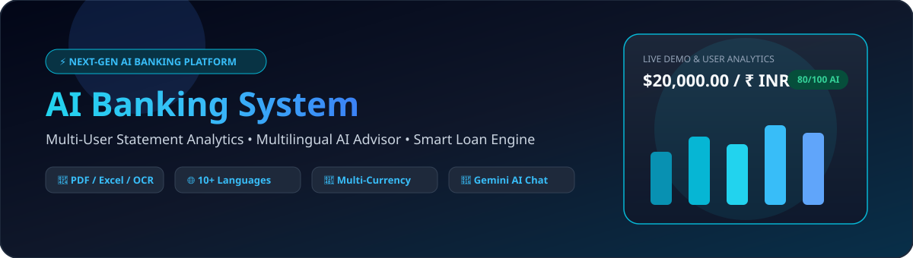

<br />

# 🏦 AI Banking System
### 🤖 Next-Gen Multi-User Financial Intelligence & Multilingual AI Advisor Platform

<p align="center">
  <a href="https://ai-banking-system-1-pdow.onrender.com">
    
  </a>
  <a href="https://ai-banking-system-1-pdow.onrender.com/robert-dashboard">
    
  </a>
  <a href="https://ai-banking-system-3gzg.onrender.com/docs">
    
  </a>
</p>

<p align="center">
  
  
  
  
  
  
  
</p>

**Transforming Raw Bank Statements (PDF, Excel/CSV, Screenshots) into Actionable Financial Intelligence with Multi-Currency, 10+ Indian & International Languages, and Conversational AI.**

</div>

---

## ⚡ Animated End-to-End Workflow

<p align="center">
  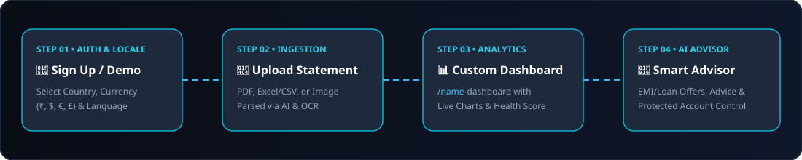
</p>

---

## 🌐 Live Deployment Links (Render)

| Environment / Route | Live URL | Description |
| :--- | :--- | :--- |
| 🖥️ **Main Web Application** | [https://ai-banking-system-1-pdow.onrender.com](https://ai-banking-system-1-pdow.onrender.com) | Landing Page, Login, Registration & Live Demo Entry |
| 🇺🇸 **Live Demo Dashboard (`Robert Wilson`)** | [https://ai-banking-system-1-pdow.onrender.com/robert-dashboard](https://ai-banking-system-1-pdow.onrender.com/robert-dashboard) | Pre-seeded `$20,000.00` USD Demo Account (Auto-restores on Refresh) |
| 🤖 **Live Demo AI Advisor** | [https://ai-banking-system-1-pdow.onrender.com/robert-dashboard/ai-advisor](https://ai-banking-system-1-pdow.onrender.com/robert-dashboard/ai-advisor) | Conversational AI Financial Advisor for Robert Wilson (`$ USD`) |
| 🇮🇳 **Custom User Dashboard Example** | [https://ai-banking-system-1-pdow.onrender.com/aaditya-dashboard](https://ai-banking-system-1-pdow.onrender.com/aaditya-dashboard) | Personalized User Dashboard (`/<first-name>-dashboard`) in `₹ INR` |
| 🧠 **Custom User AI Advisor Example** | [https://ai-banking-system-1-pdow.onrender.com/aaditya-dashboard/ai-advisor](https://ai-banking-system-1-pdow.onrender.com/aaditya-dashboard/ai-advisor) | Personalized AI Advisor driven by uploaded SBI Bank Statement |
| ⚙️ **FastAPI Backend Server** | [https://ai-banking-system-3gzg.onrender.com](https://ai-banking-system-3gzg.onrender.com) | Production REST API Service |
| 📑 **Interactive Swagger UI** | [https://ai-banking-system-3gzg.onrender.com/docs](https://ai-banking-system-3gzg.onrender.com/docs) | Live OpenAPI 3.0 Documentation |

---

## 🚀 Key Features Added & Upgraded

### 1. 👤 Multi-User Account Creation & Isolated Databases
- **Create Account (`/register`)**: Any user can register their own account with **Full Name, Email, Password, Country, and National/Regional Language**.
- **Strict Database Isolation**: New users start with a clean slate—Robert Wilson's dummy data is **never** mixed into a newly created user's account.
- **Personalized Dynamic URLs**: Every user gets their own personalized route based on their first name:
  - Dashboard: `https://ai-banking-system-1-pdow.onrender.com/<first-name>-dashboard` (e.g., `/aaditya-dashboard`)
  - AI Advisor: `https://ai-banking-system-1-pdow.onrender.com/<first-name>-dashboard/ai-advisor`
  - Statement Upload: `https://ai-banking-system-1-pdow.onrender.com/<first-name>-dashboard/upload-statement`
- **Forgot Password (`/forgot-password`)**: Users who forget their password can easily reset and update their password using their registered email.

### 2. 📄 Universal Bank Statement Upload (PDF, Excel/CSV, Image/Screenshot)
- **Multi-Format Statement Parser**:
  - **PDF Bank Statements (`.pdf`)**: Supports Indian and international bank statements (SBI, HDFC, ICICI, Chase, etc.) including multi-line tabular layouts (`Debit`, `Credit`, `Balance`) via `pypdf` + Gemini AI fallback.
  - **Excel & CSV Files (`.xlsx`, `.xls`, `.csv`)**: Automatic column detection for dates, descriptions, debits, credits, and running balances.
  - **Screenshots & Photos (`.png`, `.jpg`, `.jpeg`, `.webp`)**: Vision OCR powered by Google Gemini Multimodal AI.
- **Instant Redirect & Analysis**: As soon as a statement is uploaded, the user is automatically redirected to their `/<first-name>-dashboard` where all cards, spending charts, category breakdowns, and recent transactions reflect their uploaded statement.

### 3. 💱 Multi-Currency & 🌐 10+ Regional Languages
- **Automatic Country Currency Mapping**:
  - **India (`₹ INR`)** with Indian Lakh/Crore formatting (`₹2,35,780.71`), **United States (`$ USD`)**, **United Kingdom (`£ GBP`)**, **European Union (`€ EUR`)**, **UAE (`AED`)**, **Japan (`¥ JPY`)**, **Canada (`CA$`)**, **Australia (`A$`)**, and **Singapore (`S$`)**.
- **10 Supported Indian & International Languages**:
  - `English`, `हिन्दी (Hindi)`, `বাংলা (Bengali)`, `తెలుగు (Telugu)`, `मराठी (Marathi)`, `தமிழ் (Tamil)`, `ગુજરાતી (Gujarati)`, `ಕನ್ನಡ (Kannada)`, `മലയാളം (Malayalam)`, and `ਪੰਜਾਬੀ (Punjabi)`.

### 4. 🔄 Demo Account (`Robert Wilson`) Auto-Restore on Refresh (`$20,000.00`)
- Clicking **Live Demo** logs directly into **Robert Wilson** (`/robert-dashboard`) with `$20,000.00` Total Balance, `$6,500.00` Monthly Income, `$3,632.14` Monthly Expenses, `$5,000.00` Savings, and `80/100` Financial Health Score.
- If a user clicks **Clear Data** on the Demo Account (reducing cards to `$0.00`) or purchases an item via an AI Advisor offer (e.g., reducing balance to `$18,920.00`), simply pressing **Refresh (`F5`) or Hard Refresh (`Ctrl + Shift + R`)** on `/robert-dashboard` **automatically restores the Demo Account back to `$20,000.00`**!

### 5. 🗑️ Secure Account Deletion (Dashboard Modal + AI Advisor Conversational Flow)
- **Option A — Dashboard "Delete Account" Button**:
  - Inside the logged-in dashboard navbar, users can click **Delete Account**.
  - **Regular Users**: Must enter their **Account Login Password** to confirm. Once verified, their account and all statement data are permanently deleted, and they are redirected to the **Create Account (`/register`)** page.
  - **Demo Account (`Robert Wilson`) Admin Protection**: Nobody can delete the Demo Account without the **Admin Password**. Attempting to delete Robert Wilson's account prompts for the Admin Password.
- **Option B — Conversational Account Deletion via AI Advisor**:
  1. **Step 1 (Retention / Convince Step)**: When a user tells the AI Advisor *"Delete my account"* (or *"Mera account delete kar do"*), the AI Advisor first tries to **convince the user once** by highlighting their financial insights and suggesting *Clear Data* instead.
  2. **Step 2 (Password Prompt)**: If the user still insists (*"Yes, delete my account"*), the AI Advisor asks for their **profile login password** (or **Admin Password** if on Robert Wilson's Demo Account).
  3. **Step 3 (Verification, Deletion & Redirect)**: When the user replies with the correct password in the next message, the AI Advisor starts and completes the account deletion process and **automatically redirects the user to the Create Account (`/register`) page**.

---

## 📋 Step-by-Step User Guide (How to Use the Platform)

### Step 1: Exploring the Live Demo (`Robert Wilson`)
1. Open [https://ai-banking-system-1-pdow.onrender.com](https://ai-banking-system-1-pdow.onrender.com) and click **Live Demo** (or **Instant Demo Login (Robert Wilson)** on `/login`).
2. You will be taken to `/robert-dashboard` showing `$20,000.00` balance, spending charts, category insights, and recent transactions.
3. Click **Clear Data** to test zeroing out the demo view (`$0.00`), then press **`F5` or `Ctrl + Shift + R`**—the Demo Account automatically restores to **`$20,000.00`**.

### Step 2: Creating Your Own Account & Uploading a Bank Statement
1. Click **Get Started** or go to `/register` (**Create Account**).
2. Enter your **Full Name** (e.g., `Aaditya Acharya`), **Email**, **Password**, **Country** (e.g., `India`), and **Preferred Language** (e.g., `Hindi` or `English`).
3. Click **Sign Up & Continue**—you will be directed to `/<your-first-name>-dashboard/upload-statement`.
4. Upload your **Bank Statement** (`.pdf`, `.xlsx`, `.csv`, or screenshot image) or click **Load Instant Sample Statement**.
5. Once uploaded, you are automatically redirected to `/<your-first-name>-dashboard` where all balances, income, expenses, and charts reflect your statement in your country's currency (`₹`, `$`, `€`, `£`).

### Step 3: Using the AI Financial Advisor
1. Click the **🤖 AI Advisor** button on your dashboard (opens `/<your-first-name>-dashboard/ai-advisor`).
2. Ask any financial question (e.g., *"Can I afford a smartphone worth ₹80,000 this month?"* or *"Should I apply for a personal loan?"*).
3. The AI Advisor analyzes your uploaded statement data and generates a tailored recommendation along with an interactive **Discount Purchase Offer** or **Pre-Approved Personal Loan EMI Offer**.

### Step 4: Deleting an Account (Via Navbar or AI Advisor)
- **From Dashboard Navbar**: Click **Delete Account** -> Enter your login password (or Admin Password for Demo Account) -> Redirects to `/register`.
- **From AI Advisor Chat**:
  1. Type `"Delete my account"` -> AI Advisor tries to convince you to stay once.
  2. Reply `"Yes, delete my account"` -> AI Advisor asks for your login password (or Admin Password for Demo Account).
  3. Enter your password in the next message -> AI Advisor verifies it, deletes the account, and redirects to `/register`.

---

## 🧭 System Architecture & AI Flows

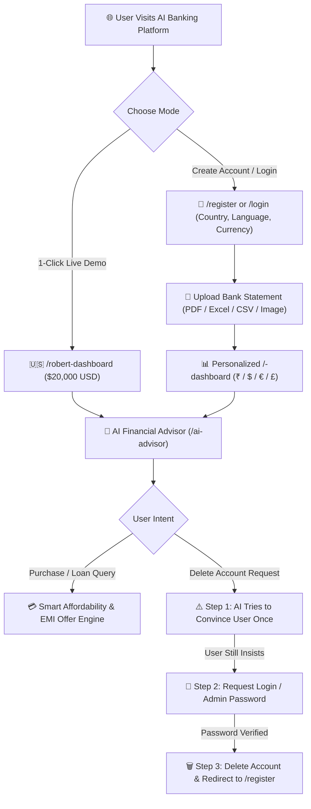
```mermaid
flowchart TD
    A["🌐 User Visits AI Banking Platform"] --> B{"Choose Mode"}
    B -->|"1-Click Live Demo"| C["🇺🇸 /robert-dashboard ($20,000 USD)"]
    B -->|"Create Account / Login"| D["🔐 /register or /login (Country, Language, Currency)"]
    D --> E["📄 Upload Bank Statement (PDF / Excel / CSV / Image)"]
    E --> F["📊 Personalized /<first-name>-dashboard (₹ / $ / € / £)"]
    C --> G["🤖 AI Financial Advisor (/ai-advisor)"]
    F --> G
    G --> H{"User Intent"}
    H -->|"Purchase / Loan Query"| I["💳 Smart Affordability & EMI Offer Engine"]
    H -->|"Delete Account Request"| J["⚠️ Step 1: AI Tries to Convince User Once"]
    J -->|"User Still Insists"| K["🔑 Step 2: Request Login / Admin Password"]
    K -->|"Password Verified"| L["🗑️ Step 3: Delete Account & Redirect to /register"]
```

---

## 📷 Application Screenshots

### 🔐 Login & Authentication Page
<p align="center">
  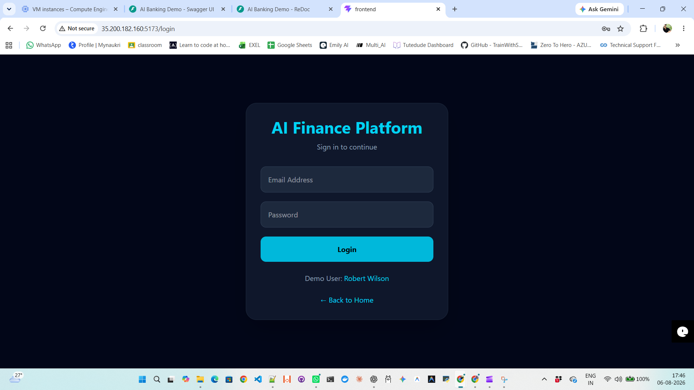
</p>

### 🏦 Smart Banking Dashboard
<p align="center">
  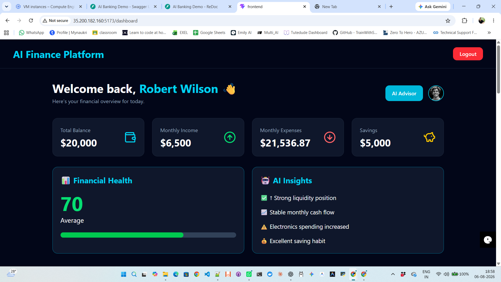
</p>

### 📊 Interactive Spending Analytics & Graphs
<p align="center">
  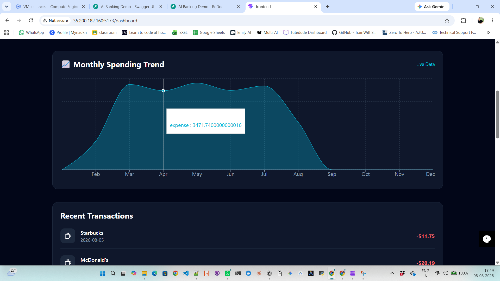
</p>

### 🤖 AI Banking Intelligence Overview
<p align="center">
  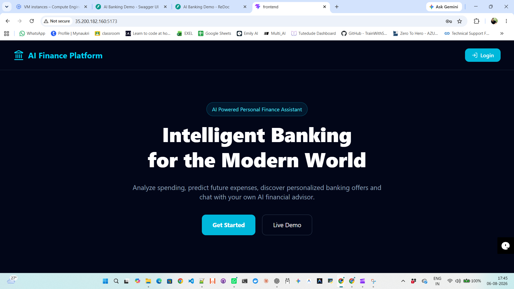
</p>

### 💰 Category-Wise AI Spending Analysis
<p align="center">
  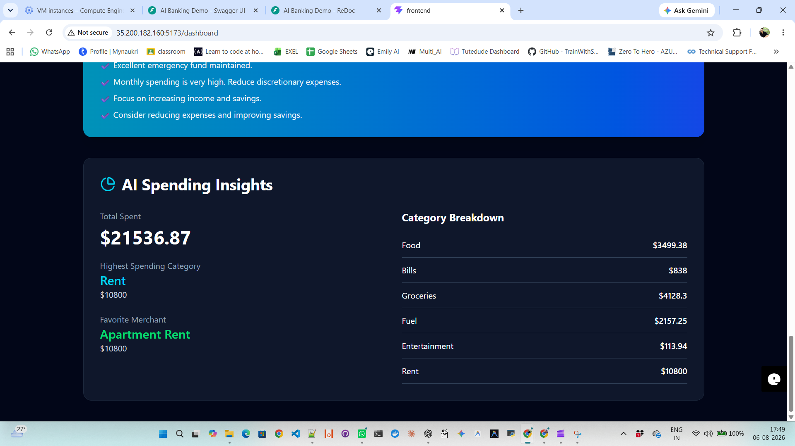
</p>

### ❤️ AI Financial Health Check
<p align="center">
  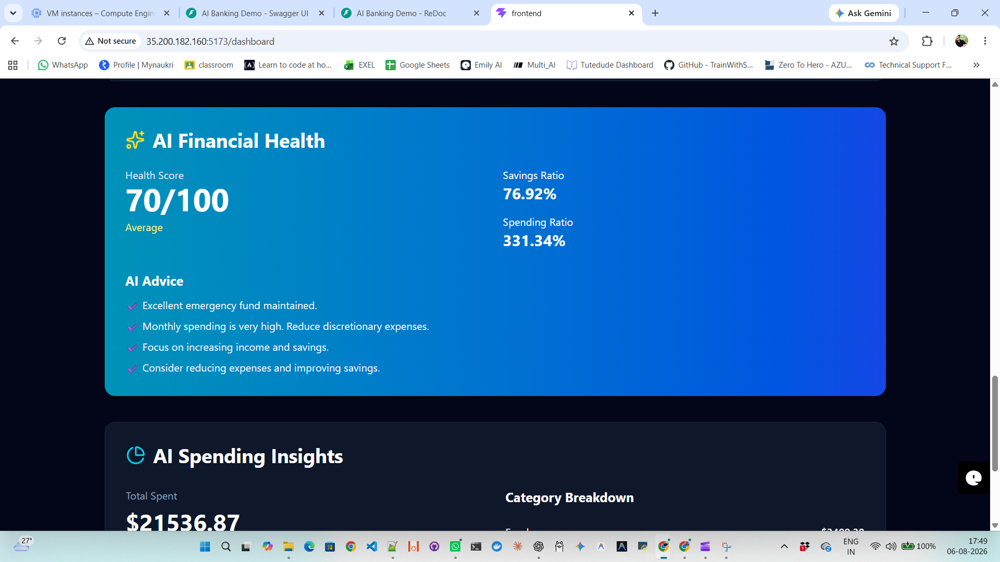
</p>

### 💡 Personalized AI Recommendations & EMI Offers
<p align="center">
  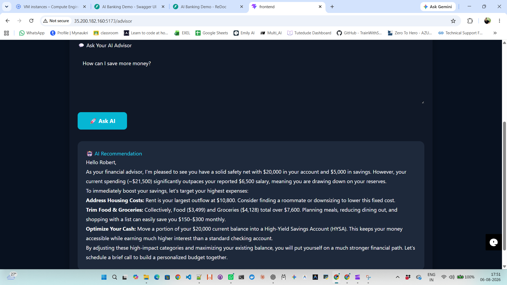
</p>

### 🧠 Conversational AI Financial Advisor
<p align="center">
  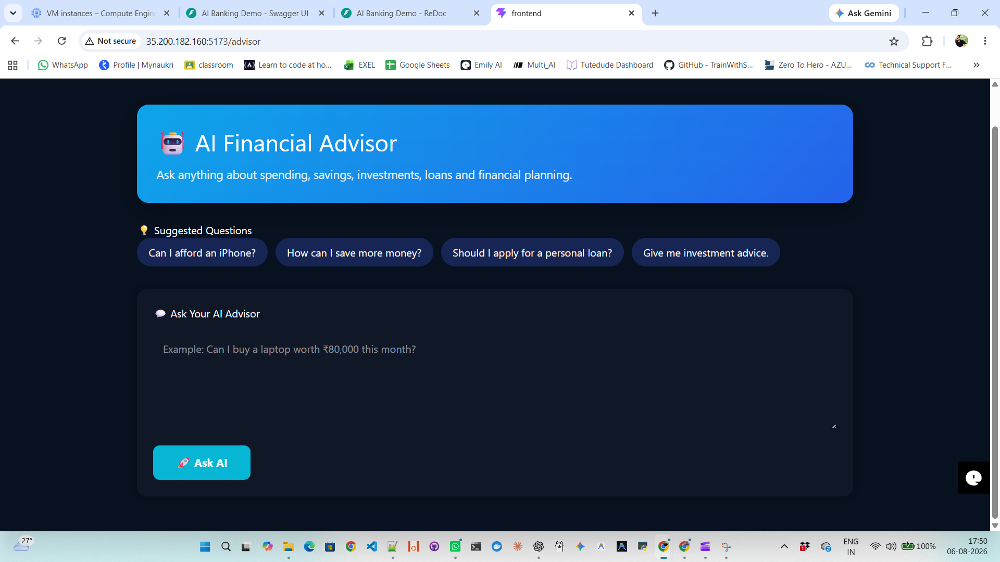
</p>

### 📑 FastAPI Swagger Documentation
<p align="center">
  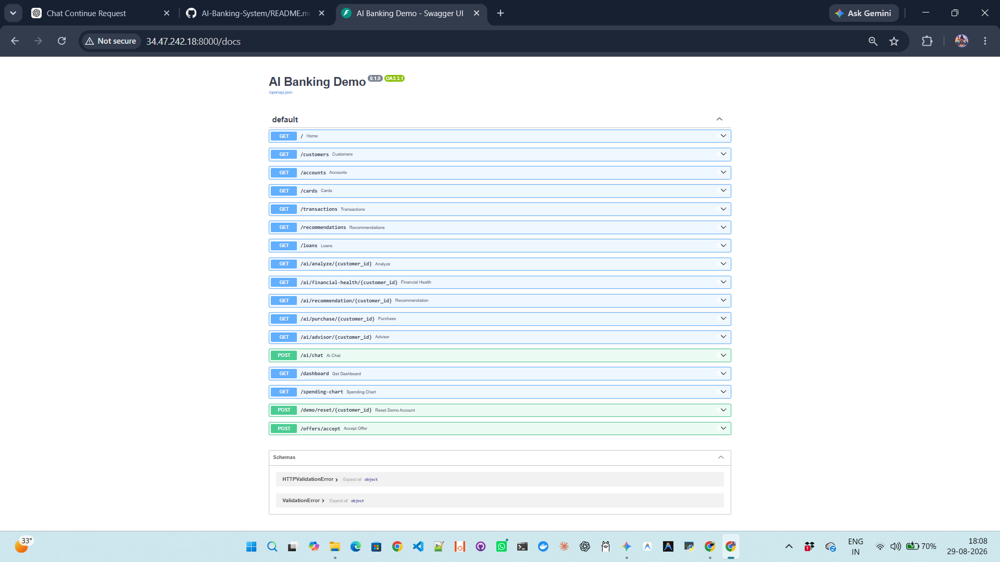
</p>

---

## 📡 Core REST API Endpoints

| Method | Endpoint | Description |
| :--- | :--- | :--- |
| `POST` | `/auth/register` | Register a new user with country, preferred language & currency |
| `POST` | `/auth/login` | Authenticate user credentials or 1-click Demo User (`Robert Wilson`) |
| `POST` | `/auth/forgot-password` | Reset user password by registered email |
| `POST` | `/auth/delete-account` | Delete user account (verifies user password or Admin Password for Demo) |
| `GET` | `/auth/resolve-slug/{slug}` | Resolve `/<first-name>-dashboard` slug to the active customer profile |
| `POST` | `/statements/upload` | Parse & load PDF, Excel/CSV, or Image bank statement for a customer |
| `POST` | `/statements/sample` | Generate sample statement in the customer's native currency |
| `POST` | `/statements/clear` | Clear uploaded statement transactions for a customer |
| `GET` | `/dashboard?customer_id=N` | Fetch balance, income, expenses, savings & health score (auto-restores Demo on refresh) |
| `GET` | `/transactions?customer_id=N` | Fetch customer transactions sorted by date |
| `GET` | `/spending-chart?customer_id=N` | Fetch monthly debit totals for area chart |
| `GET` | `/ai/analyze/{customer_id}` | Category breakdown, top category & favorite merchant analysis |
| `GET` | `/ai/financial-health/{id}` | Calculate 0–100 financial health score, savings ratio & AI advice |
| `POST` | `/ai/chat` | Conversational AI Advisor (financial advice, EMI/loan offers & 3-step account deletion) |
| `POST` | `/demo/reset/1` | Restore Robert Wilson Demo Account to `$20,000.00` and 433 transactions |

---

## 🛠️ Local Setup & Installation

### 1. Clone the Repository
```bash
git clone https://github.com/ai-aadi-ops/AI-Banking-System.git
cd AI-Banking-System
```

### 2. Run with Docker Compose
```bash
docker compose up --build
```

### 3. Or Run Manually (Backend + Frontend)

#### Backend (`FastAPI`)
```bash
cd backend
python -m venv venv
venv\Scripts\activate      # Windows (or `source venv/bin/activate` on Linux/macOS)
pip install -r requirements.txt
uvicorn app.main:app --reload --port 8000
```

#### Frontend (`React + Vite`)
```bash
cd frontend
npm install
npm run dev
```

---

## 👨‍💻 Author

**Aaditya Acharya**  
*DevOps Engineer • AI Enthusiast • Cloud Engineer*

- 📧 **Email**: [aadityaacharya2109@gmail.com](mailto:aadityaacharya2109@gmail.com)
- 🔗 **LinkedIn Profile**: [linkedin.com/in/aaditya-ops](https://www.linkedin.com/in/aaditya-ops/)
- 🎥 **LinkedIn Project Demo**: [Watch Demonstration Post](https://www.linkedin.com/posts/aaditya-ops_ai-artificialintelligence-generativeai-ugcPost-7491110214000111616-k5eH)
- 💻 **GitHub Portfolio**: [github.com/ai-aadi-ops](https://github.com/ai-aadi-ops)

---

<div align="center">

### ⭐ If you found this project useful, please give it a Star on GitHub!

</div>
